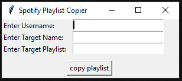

# Copy-Spotify-Playlists
A Python application that allows users to copy other Spotify users' playlists onto their own Spotify accounts. Created using the Spotify API via the Spotipy Python library.

# How to use:
The GUI is rather intuitive. Input your spotify username, the username of the user whose playlist you wish to copy, and the name of that Spotify playlist. Then, click the 'copy playlist' button, and (after authentication), the playlist will be copied to your Spotify account.
 
# Information
This application is a work-in-progress and will be constantly updated at varying intervals of time. This project was created as a means for me to start learning about how to modify Spotify accounts via the Spotify library, as well as solve a problem for one of my friends (copying Spotify playlists.)

# Room for improvement
- Copy items such as: descriptions, playlist cover images, etc.
